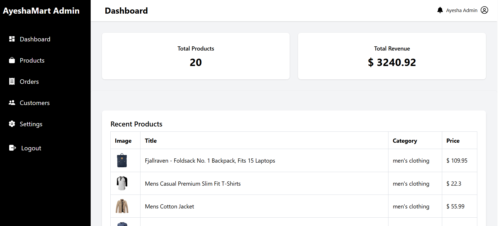
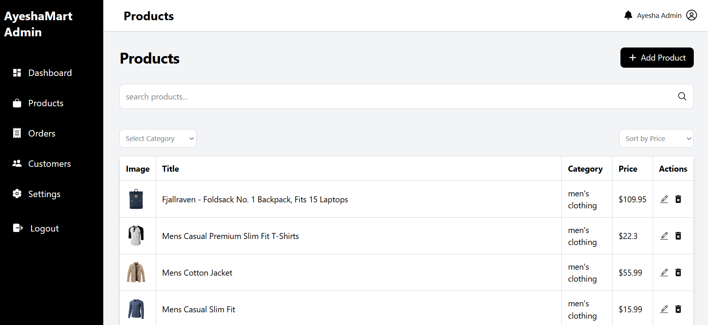

# 🛍️ AyeshaMart - Premium Admin Dashboard Panel

A responsive, high-performance E-Commerce Admin Console built with **React**, **Vite**, and **Tailwind CSS**. This dashboard enables store operators to manage dynamic product catalogs, monitor revenue metrics, sort inventory listings, and handle validation-secured workflows.
<br/>

<br/>

<div align="center">

  <!-- TECH STACK BADGES -->
  
  
  
  
  
  
  

</div>

---
## 🚀 Live Demo
👉 https://ayesha-saddique9.github.io/Admin-Panel/

---
## 📸 Screenshots

### 🏠 Dashboard


### 📦 Products


---
## ✨ Features

- 📊 Dashboard analytics (total products & revenue)
- 📦 Product management (Add, Edit, Delete)
- 🔍 Real-time search functionality
- 🧾 Category filtering & sorting
- 📱 Fully responsive design
- 🧭 Sidebar navigation (mobile toggle)
- ✅ Form validation with Zod
- ⚡ Clean and minimal SaaS UI

---

## 🛠️ Tech Stack

### ⚛️ Frontend
- React.js  
- React Router DOM  
- Tailwind CSS  

### 📦 Forms & Validation
- React Hook Form  
- Zod

### 🎨 UI & Icons
- React Icons  

### 🌐 API
- FakeStore API  

---
## 📚 What I Learned

- Building a complete admin dashboard layout
- Managing state and component structure in React
- Handling forms using React Hook Form
- Implementing schema validation with Zod
- Creating responsive UI using Tailwind CSS
- Implementing routing using React Router
- Performing CRUD operations

---
## ⚙️ Installation & Setup
**1. Clone the repository**
```bash
git clone https://github.com/Ayesha-Saddique9/Admin-Panel
```
**2.Navigate into the directory**
```bash
cd Admin-Panel
```
**3. Install dependencies**
```bash
npm install
```
**4. Start the development server**
```bash
npm run dev
```
---
## 🚀Future Improvement
- 🔔 Toast notifications
- ⏳ Loading skeletons
- 📱 Better mobile table UI
- 🔐 Authentication system
- 🌐 Backend integration (MERN)
---

## 👩‍💻 Author

**Ayesha Saddique** 
Frontend Web Developer

🔗 GitHub: https://github.com/Ayesha-Saddique9

💼 LinkedIn: https://linkedin.com/in/ayesha-saddique9

📧 Email: ayeshasaddique70@gmail.com

⭐ If you found this project useful, consider giving it a star!

"Building logic, solving problems, and designing premium user experiences."
